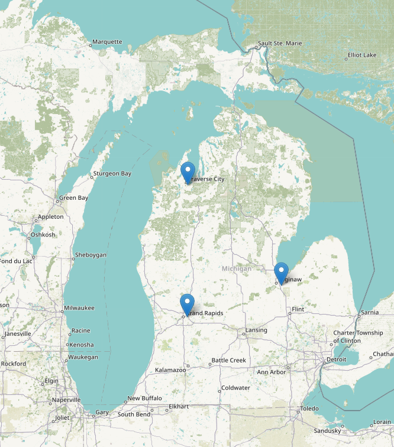
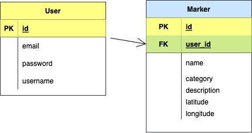

<h1 align="center">Routy Backend</h1>



<p align="center">Rails API application.</p>

---

### Table of Content

- [Description](#description)
- [Specification](#specification)
  - [Backend](#backend)
    - [Versioning](#versioning)
    - [Database](#database)
- [Installation](#installation)
- [How to use this app](#how-to-use-this-app)
- [Challanges](#challanges)
- [Future upgrades](#future-upgrades)
- [Bugs](#bugs)
- [Credits](#credits)
- [License](#license)
- [branching](#branching)
  - [main](#main)
  - [integrating_devise](#integrating_devise)
- [Testing with Paw](#testing-with-paw)

---

## Description

This is server part of **Routy Application**. 

**Backend:** is built in Ruby on Rails as a new API and **Frontend:** is a Single Page Application(SPA) written in JavaScript. 
In the backend part, we use **devise** and **JWT** gems for authentication and authorization to welcome our users and give them the option to create a new account or log in to an existing one and save important places and load them on the leaflet map.

---

## Specification

### Backend

The server side of this application is build with Ruby on Rails and postgreSQL as database only as API. Some of added gems are:  
- `gem "rack-cors"` - provides support for Cross-Origin Resource Sharing (CORS) for Rack compatible web applications.
- `gem "jbuilder"` - template engine for rendering a JSON response and all files are located in 'app/views/v1' folder.
- `gem "devise"`- used for user authentication 
- `gem "JWT"` - used for token-based verification method 


<spam style="color:yellow">_NOTE: command to run: `rails new <app_name> --database=postgresql --api`._ </spam>

#### Versioning

- Ruby: `ruby 3.0.0p0`
- Ruby on Rails: `Rails 7.0.3`

<spam style="color:yellow">_NOTE: This can be checked by running `ruby -v ` and `rails -v ` in root folder of this application._ </spam>

#### Database

Database used for this application is postgreSQL.

<details>
<summary>See database schema</summary>


_<p align="center"> Database schema </p>_

</details>
___

## Installation

1.  Backend [(github link)](https://github.com/zicna/quiz_backend.git 'backend repo')

- fork this repo
- clone it to your local environment
- terminal commands to setup backend:

```
bundle install
rails db:create
rails db:migrate
rails db:seed
rails server
```

<spam style="color:yellow">NOTE: We can check API we are getting from server by navigating to `http://localhost:3000/users` </spam>

---

## How to use this app

- After all steps from **Installation** are done usrs can navigate to `http://localhost:3000/users` to see API provided by server
- The rest of application is on frontend part which we can check [here](https://github.com/zicna/quiz_frontend).

<spam style="color:yellow">*NOTE: Here is a good place to point out that as we know *seed.rb\* file is used for dummy date during our development and test phases but we will require you to run `rails seed` command and it will give you some data you do not really need (such as 3,4 users with their results) but it will also give you some essential ones for this app to work: quiz, questions, and options for those questions. </spam>

---

## Challanges

- database setup, so users can have multiple takes
- API structure, methods and scopes, all data manipulations would be done in the backend
- sending data of selected anwers back to the server side.

---

## Future upgrades

- [x] Fix readme.md file
- [ ] Adding user validation

---

## Bugs

1. Once `new take` is created if we hit refresh take will stay with nothing selected therefore it will appear as the user had `take` with no correct answers

---

## Credits

Great help for this app to see light of the day goes to [Candice Peaters](https://github.com/candicelizabeth). Thank you!

---

## License

This application is avaiable as open source under the terms of the [MIT License](LICENSE).


## branching
 ### main 
 - is using JWT for creating token and all authentication 

 ### integrating_devise
 - is integrating devise gem for rails app authentiacation
 - this branch was merged into main and deleted

## Testing with Paw
- checkout `Rails-api-devise-jwt.paw` for testing api with Paw
